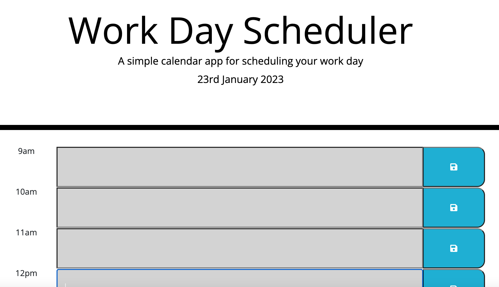

# Work Day Scheduler

## Description

This is challenge 7 of the Front-End Web Developer bootcamp. The purpose of the challenge is to create a simple calendar application that allows a user to save events for each hour of the day by modifying the starter code. 

To do so, I used Javascript, JQuery and Moment.js

## How the programme works

* When the user opens the page, the current day appears at the top of the calender 
 
* The calendar is composed of timeblocks for standard business hours when the user scrolls down.
 
* Depending on what time of the day it currently is, the colour in timeblocks changes, with three different colours for past, present, and future.
 
* For each hour, an input area is available for users to add events reminders.

* Once events are added and saved, they are stored in local storage and persist after refreshing a page.

The application looks like the below and the deployed code can be found [here](https://helenesauve.github.io/work-day-scheduler/)

